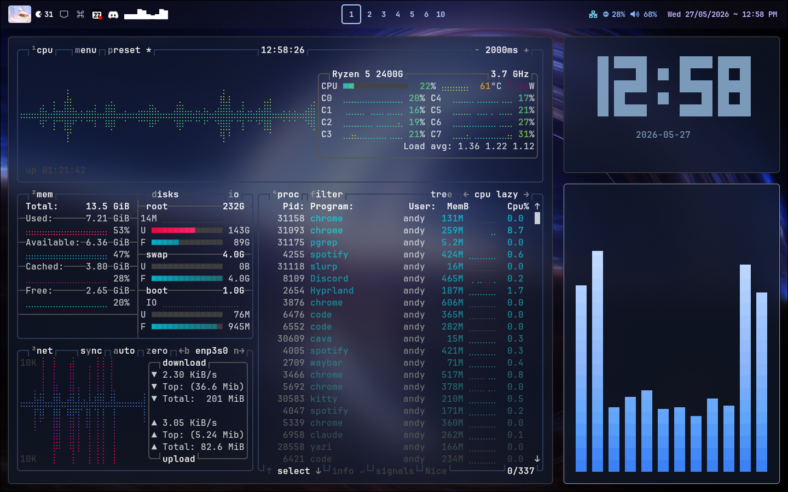
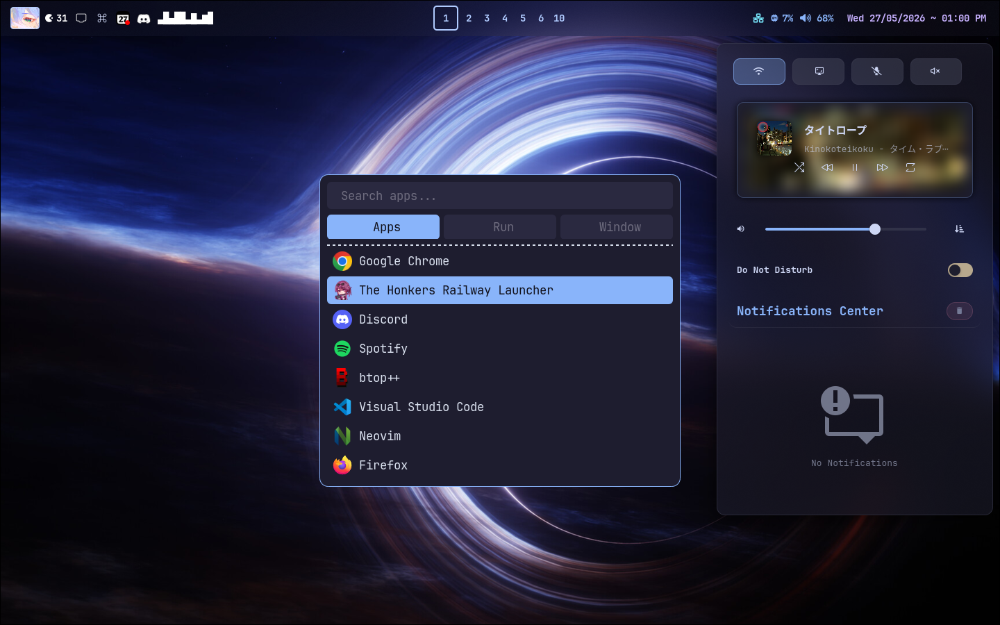
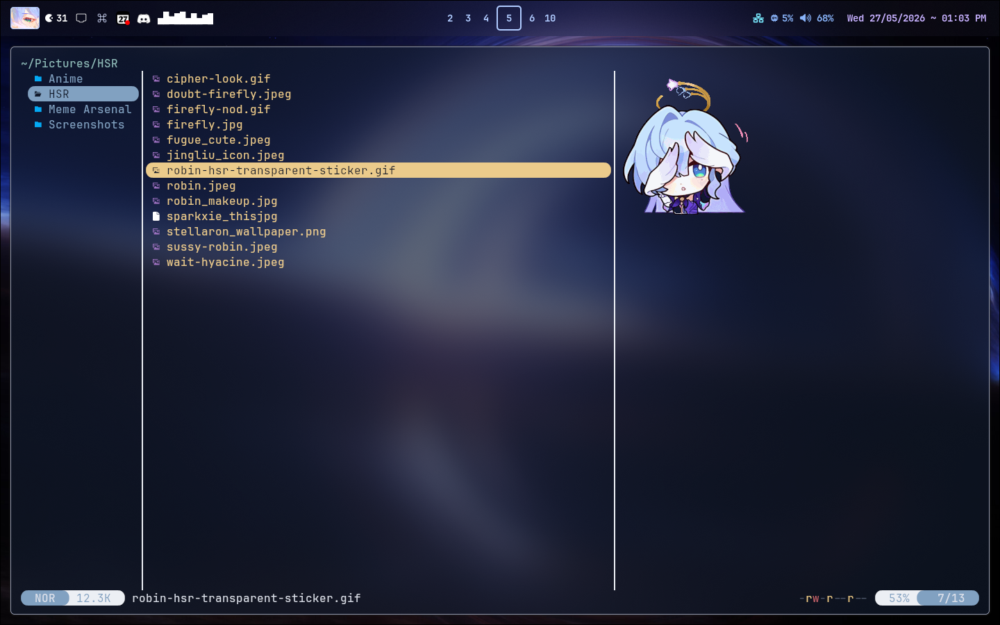
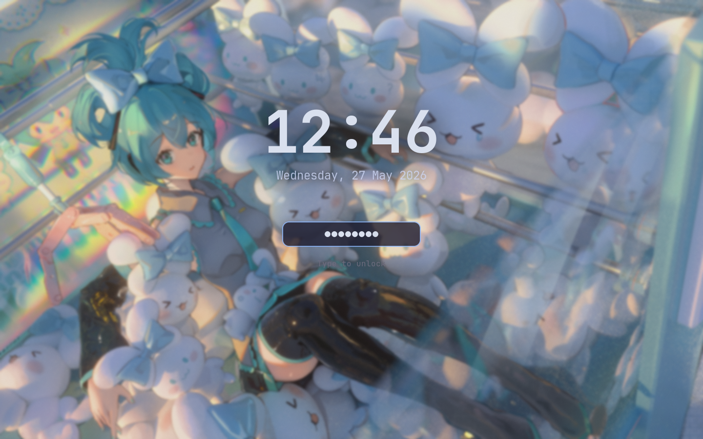
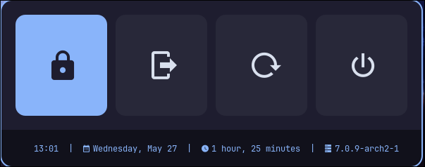

# auvry's dotfiles

My personal Arch Linux + Hyprland setup.

---

## Desktop



Desktop overview featuring btop system monitor, Cava audio visualizer, and tty-clock.

---



Rofi app launcher (drun) and the Swaync notification center panel.

---



Yazi terminal file manager.

---

## Lock Screen



Hyprlock with blurred wallpaper, large clock, and minimal password input.

---

## Power Menu



Rofi-based powermenu for shutdown, reboot, lock, suspend and logout.

---

## Setup

| Category | Tool |
|---|---|
| OS | Arch Linux |
| WM | Hyprland |
| Bar | Waybar + waybar-cava |
| Terminal | Kitty / Ghostty |
| Shell | Zsh + Oh My Posh |
| Editor | Neovim |
| File manager | Yazi / Dolphin |
| Launcher | Rofi |
| Notifications | Swaync |
| Wallpaper | awww + mpvpaper |
| Audio visualizer | Cava |
| Clipboard | cliphist + wl-copy |
| Logout menu | Wlogout |
| Browser | Google Chrome |
| Input method (JP) | Fcitx5 |
| System info | Fastfetch |
| System monitor | Btop |

---

## Structure

```
~/.config/
├── hypr/           # Hyprland & Hyprlock config
├── auvry/          # Custom scripts (wallpaper, launcher, clipboard, etc.)
├── waybar/         # Status bar
├── rofi/           # App launcher & powermenu
├── swaync/         # Notification center
├── wlogout/        # Logout menu
├── kitty/          # Kitty terminal
├── ghostty/        # Ghostty terminal
├── nvim/           # Neovim
├── btop/           # System monitor
├── cava/           # Audio visualizer
├── gtk-3.0/        # GTK theming
├── colors/         # Shared color variables
└── screenshots/    # Dotfiles preview screenshots
```

---

## Keybindings (highlights)

| Keybind | Action |
|---|---|
| `Super + Space` | App launcher (Rofi) |
| `Super + T` | Notification center (Swaync) |
| `Super + W` | Wallpaper selector (toggle) |
| `Super + Shift + W` | Random wallpaper |
| `Super + V` | Clipboard history |
| `Super + .` | Emoji picker |
| `Super + Ctrl + H` | Keybinding hints |
| `Super + Shift + S` | Screenshot → save to file |
| `Ctrl + Print` | Screenshot → copy to clipboard |
| `Ctrl + Shift + Print` | Screenshot → save to ~/Pictures/Screenshots |

---

## Installation

> Manual setup — clone and symlink or copy the folders you want into `~/.config/`.

```bash
git clone https://github.com/Auvryy/dotfiles ~/.dotfiles
```

Then copy or symlink the configs you need. No install script yet.
